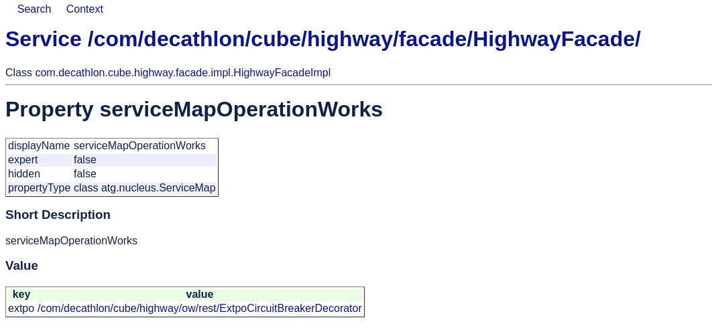
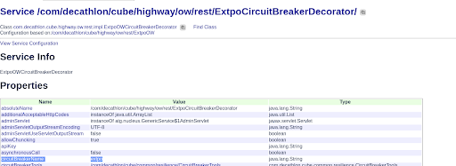
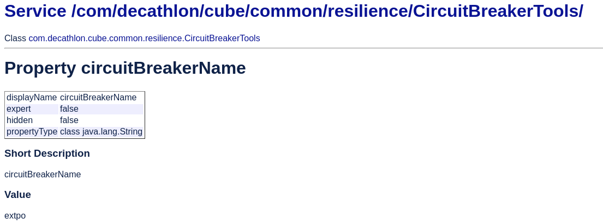

# Resilience4J - Circuit Breaker

## What is it ?

Circuit Breaker monitors API calls. When everything is working as expected, it is in the state closed. When the number of fails, like timeout, reaches a specified threshold, Circuit Breaker will stop processing further requests. We call it the open state.

The Circuit is opened for a specified period of time. After timeout occurs, the circuit breaker goes into the half-opened state. Next, the API call will hit the external system/API. After that, the circuit will decide whether to close or open itself.

See More details [here](https://resilience4j.readme.io/docs/circuitbreaker)

## How does it work ?

Circuit breakers of all OperationWorkers are stored in a registry in :
> com/decathlon/cube/common/resilience/CircuitBreakerManager/

You can also find a default configuration and some custom configurations for some OW.
Default Circuit Breaker config is :
> /com/decathlon/cube/common/resilience/config/DefaultCircuitBreakerConfig/

>V0 Only :

>Facade which use circuitBreaker would have a circuitBreakerDecorator instead of initial ow in his serviceMapOperationWorks. Ie with HighwayFacade :

>This circuitBreakerDecorator does the same as initial OW but he does using a >circuitBreaker defined by circuitBreakerName (by using CircuitBreakerTools). IE with ExtpoCircuitBreakerDecorator.

## How to monitor ?

You need to go to **CircuitManager** Component and fill the circuitBreakerName property.

For Example with extpo :

You can then use these methods :

* openCircuitBreaker : it opens circuit breaker linked to the name
* closeCircuitBreaker : it closes circuit breaker linked to the name
* forceOpenCircuitBreaker : it changed circuit breaker linked to the name to force Open State (All calls are always Denied)
* disableCircuitBreaker : it disables circuit breaker (always accept)
* showNumberOfFailedCalls
* showNumberOfSucessfullCalls
* showCircuitBreakerState

## How to disable circuit breaker ?

There are 2 options :

* With **CircuitBreakerManager** : fill circuit breaker name you want to disable and call method disableCircuitBreaker
* With **Facade** : update facade serviceMapOperationsWorks with initial OperationWorker

## How to manage circuit breaker Configurations ?

There are many configurations on each CircuitBreakerConfig component :

* **failureRateThreshold** : Configures the failure rate threshold in percentage.
When the failure rate is equal or greater than the threshold the CircuitBreaker transitions to open and starts short-circuiting calls.
* **minimumNumberOfCalls** : Configures the minimum number of calls which are required (per sliding window period) before the CircuitBreaker can calculate the error rate or slow call rate.
For example, if minimumNumberOfCalls is 10, then at least 10 calls must be recorded, before the failure rate can be calculated.
If only 9 calls have been recorded the CircuitBreaker will not transition to open even if all 9 calls have failed.
* **slowCallDurationThreshold** : Configures the duration threshold above which calls are considered as slow and increase the rate of slow calls.
slowCallRateThreshold : Configures a threshold in percentage. The CircuitBreaker considers a call as slow when the call duration is greater than slowCallDurationThreshold
When the percentage of slow calls is equal or greater the threshold, the CircuitBreaker transitions to open and starts short-circuiting calls.
* **waitDurationInOpenState** : The time that the CircuitBreaker should wait before transitioning from open to half-open.

More informations : https://resilience4j.readme.io/docs/circuitbreaker

1. Go to the configuration component you want to update , for example :
> com/decathlon/cube/common/resilience/config/ExtpoCircuitBreakerConfig/

2. Update values you want to update
3. DoStartService
4. Go to CircuitBreakerManager and call a DoStartService or initializeCircuitBreakerConf
